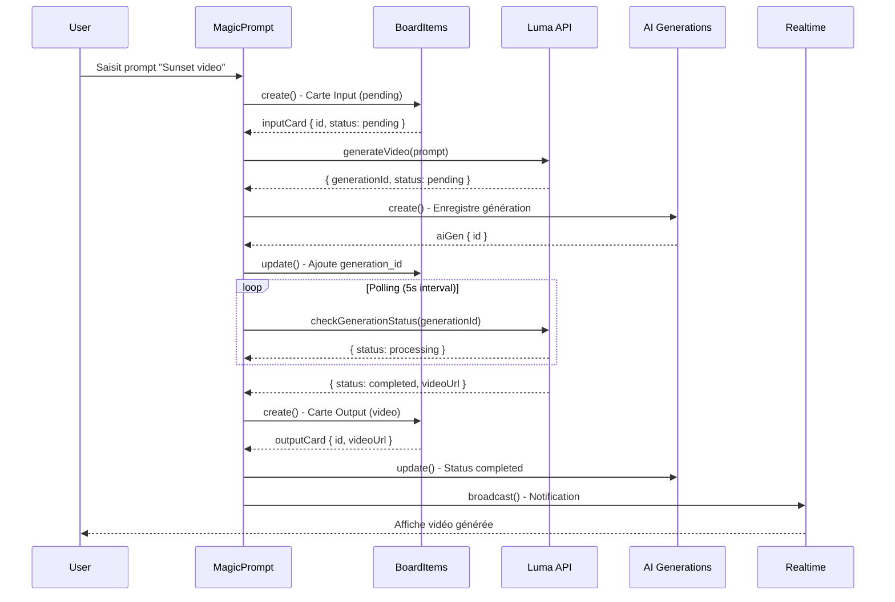

# 🎨 Elite Visuals - Mapping Complet des Données & Relations Visuelles

> **Document d'Architecture Technique**  
> Analyse complète du Board Infini, modèles de données, relations visuelles et flow Luma AI

---

## 📋 Table des Matières

1. [Vue d'Ensemble](#vue-densemble)
2. [Architecture des Données](#architecture-des-données)
3. [Modèles TypeScript/React](#modèles-typescriptreact)
4. [Relations Visuelles & Interactions](#relations-visuelles--interactions)
5. [Flow Luma AI - Input → Output](#flow-luma-ai---input--output)
6. [Diagrammes Techniques](#diagrammes-techniques)

---

## 🎯 Vue d'Ensemble

### Concept du Board Infini

Elite Visuals est un **OS Créatif Collaboratif** qui fusionne :
- **Board Visuel Infini** (Konva.js) - Canvas interactif avec zoom/pan illimité
- **Kanban IA** - Gestion de tâches avec agents autonomes
- **Génération IA Multi-modale** - Luma, Claude, Ollama

### Types de Données Supportés

| Type | Description | Format | Stockage |
|------|-------------|--------|----------|
| **Vidéo** | .mp4, .mov, URLs YouTube | `video` | Supabase Storage + metadata |
| **Image** | .png, .jpg, .webp | `image` | Supabase Storage |
| **Texte** | Notes, scripts, briefs | `text` | JSONB content |
| **Audio** | .mp3, transcriptions | `audio` | Storage + Whisper API |
| **PDF** | Documents, présentations | `pdf` | Storage + OCR |
| **URL** | Liens externes, embeds | `url` | Metadata JSONB |
| **AI-Generated** | Contenu généré par IA | `ai-generated` | Lié à `ai_generations` |
| **Kanban** | Tâches et workflows | `tasks` | Table dédiée |

---

## 🗄️ Architecture des Données

### Schéma PostgreSQL (Supabase)

```sql
-- TABLES PRINCIPALES
┌─────────────────────────────────────────────────────────────┐
│                    ARCHITECTURE SUPABASE                     │
└─────────────────────────────────────────────────────────────┘

auth.users (Supabase Auth)
    │
    └──► profiles (1:1)
            │
            ├──► boards (1:N) ──────┐
            │       │                │
            │       ├──► board_items (1:N)
            │       ├──► tasks (1:N)
            │       ├──► comments (1:N)
            │       ├──► ai_generations (1:N)
            │       └──► board_collaborators (N:M)
            │
            └──► tasks.assigned_user_id (N:1)
```

### Tables Détaillées

#### 1️⃣ **profiles** - Profils Utilisateurs
```typescript
{
  id: UUID (PK, FK → auth.users)
  email: TEXT
  full_name: TEXT
  avatar_url: TEXT
  created_at: TIMESTAMPTZ
  updated_at: TIMESTAMPTZ
}
```

#### 2️⃣ **boards** - Boards Visuels
```typescript
{
  id: UUID (PK)
  title: TEXT
  owner_id: UUID (FK → profiles)
  description: TEXT
  is_public: BOOLEAN
  thumbnail_url: TEXT
  created_at: TIMESTAMPTZ
  updated_at: TIMESTAMPTZ
}
```

#### 3️⃣ **board_items** - Éléments du Board (CŒUR DU SYSTÈME)
```typescript
{
  id: UUID (PK)
  board_id: UUID (FK → boards)
  type: ENUM('text', 'image', 'video', 'audio', 'pdf', 'url', 'ai-generated')
  
  // Position & Dimensions (Canvas Konva)
  x: FLOAT
  y: FLOAT
  width: FLOAT
  height: FLOAT
  z_index: INTEGER
  
  // Contenu Flexible
  content: JSONB {
    // Pour type='text'
    text?: string
    
    // Pour type='image'|'video'|'audio'|'pdf'
    url?: string
    storage_path?: string
    
    // Pour type='url'
    embed_url?: string
    
    // Pour type='ai-generated'
    generation_id?: UUID
    ai_provider?: 'luma' | 'claude' | 'ollama'
    prompt?: string
    result_url?: string
  }
  
  // Métadonnées Extensibles
  metadata: JSONB {
    // Clustering
    cluster_id?: string
    cluster_name?: string
    
    // Relations visuelles
    connected_to?: UUID[]
    
    // Luma AI spécifique
    luma_generation_id?: string
    luma_status?: 'pending' | 'processing' | 'completed' | 'failed'
    
    // Transcription/OCR
    transcription?: string
    ocr_text?: string
    
    // Annotations
    tags?: string[]
    color?: string
  }
  
  title: TEXT
  created_at: TIMESTAMPTZ
  updated_at: TIMESTAMPTZ
}
```

#### 4️⃣ **tasks** - Tâches Kanban
```typescript
{
  id: UUID (PK)
  board_id: UUID (FK → boards)
  title: TEXT
  description: TEXT
  status: ENUM('backlog', 'in-progress', 'review', 'done')
  assigned_to: ENUM('openai', 'claude', 'luma', 'human')
  assigned_user_id: UUID (FK → profiles)
  ai_generated: BOOLEAN
  priority: ENUM('low', 'medium', 'high', 'urgent')
  due_date: TIMESTAMPTZ
  completed_at: TIMESTAMPTZ
  created_at: TIMESTAMPTZ
  updated_at: TIMESTAMPTZ
}
```

#### 5️⃣ **ai_generations** - Historique Générations IA
```typescript
{
  id: UUID (PK)
  board_id: UUID (FK → boards)
  user_id: UUID (FK → profiles)
  ai_provider: ENUM('openai', 'claude', 'luma', 'ollama')
  prompt: TEXT
  result: JSONB {
    // Pour Luma
    generation_id?: string
    video_url?: string
    thumbnail_url?: string
    aspect_ratio?: '16:9' | '9:16' | '1:1'
    
    // Pour Claude/Ollama
    text_output?: string
    
    // Métadonnées
    duration_seconds?: number
    file_size_bytes?: number
  }
  status: ENUM('pending', 'processing', 'completed', 'failed')
  error_message: TEXT
  created_at: TIMESTAMPTZ
  completed_at: TIMESTAMPTZ
}
```

#### 6️⃣ **comments** - Système de Commentaires
```typescript
{
  id: UUID (PK)
  board_id: UUID (FK → boards)
  item_id: UUID (FK → board_items, nullable)
  user_id: UUID (FK → profiles)
  content: TEXT
  x: FLOAT (position sur canvas)
  y: FLOAT
  created_at: TIMESTAMPTZ
  updated_at: TIMESTAMPTZ
}
```

#### 7️⃣ **board_collaborators** - Collaboration
```typescript
{
  id: UUID (PK)
  board_id: UUID (FK → boards)
  user_id: UUID (FK → profiles)
  role: ENUM('owner', 'editor', 'viewer')
  created_at: TIMESTAMPTZ
  
  UNIQUE(board_id, user_id)
}
```

---

## 🔗 Modèles TypeScript/React

### Types de Base (`lib/supabase/types.ts`)

```typescript
// Types générés depuis la DB
export type BoardItem = {
  id: string
  board_id: string
  type: 'text' | 'image' | 'video' | 'audio' | 'pdf' | 'url' | 'ai-generated'
  x: number
  y: number
  width: number
  height: number
  content: Json
  title: string | null
  metadata: Json | null
  z_index: number
  created_at: string
  updated_at: string
}

export type AIGeneration = {
  id: string
  board_id: string
  user_id: string
  ai_provider: 'openai' | 'claude' | 'luma' | 'ollama'
  prompt: string
  result: Json | null
  status: 'pending' | 'processing' | 'completed' | 'failed'
  error_message: string | null
  created_at: string
  completed_at: string | null
}
```

### Modèles React (`components/board/InfiniteBoard.tsx`)

```typescript
interface BoardItem {
  id: string
  type: "text" | "image" | "video" | "file" | "ai-generated"
  x: number
  y: number
  width: number
  height: number
  content: any
  title?: string
  clusterId?: string
}

interface Cluster {
  id: string
  name: string
  itemIds: string[]
  color: string
}
```

### Client Supabase (`lib/supabase/client.ts`)

```typescript
// Créer un item
boardItems.create({
  board_id: 'uuid',
  type: 'ai-generated',
  x: 100,
  y: 200,
  width: 300,
  height: 200,
  content: {
    generation_id: 'luma_gen_123',
    result_url: 'https://...',
    prompt: 'Sunset over ocean'
  },
  metadata: {
    luma_generation_id: 'luma_gen_123',
    luma_status: 'completed'
  }
})

// Créer une génération AI
aiGenerations.create({
  board_id: 'uuid',
  ai_provider: 'luma',
  prompt: 'Cinematic sunset video'
})
```

---

## 🎨 Relations Visuelles & Interactions

### Canvas Konva - Système de Coordonnées

```
┌─────────────────────────────────────────────────────────┐
│  Board Infini (Konva Stage)                             │
│                                                          │
│  Origin (0,0)                                            │
│  ┌──────────────────────────────────────────────┐       │
│  │                                               │       │
│  │  BoardCard (x:100, y:200)                    │       │
│  │  ┌─────────────────────┐                     │       │
│  │  │  type: 'video'      │                     │       │
│  │  │  width: 300         │                     │       │
│  │  │  height: 200        │                     │       │
│  │  │  z_index: 5         │                     │       │
│  │  └─────────────────────┘                     │       │
│  │                                               │       │
│  │  Comment (x:150, y:180)                      │       │
│  │  ●  "Ajouter musique"                        │       │
│  │                                               │       │
│  └──────────────────────────────────────────────┘       │
│                                                          │
│  Viewport: { x: -500, y: -300, scale: 1.5 }            │
└─────────────────────────────────────────────────────────┘
```

### Interactions Utilisateur

#### 1. **Drag & Drop de Fichiers**
```typescript
// components/board/InfiniteBoard.tsx
const onDrop = useCallback((acceptedFiles: File[]) => {
  acceptedFiles.forEach((file) => {
    const reader = new FileReader()
    reader.onload = () => {
      const newItem: BoardItem = {
        id: uuid(),
        type: file.type.startsWith("image") ? "image" : "file",
        x: Math.random() * 800,
        y: Math.random() * 600,
        width: 200,
        height: 200,
        content: reader.result,
        title: file.name,
      }
      setItems((prev) => [...prev, newItem])
    }
    reader.readAsDataURL(file)
  })
}, [])
```

#### 2. **Zoom & Pan**
```typescript
const handleWheel = (e: any) => {
  e.evt.preventDefault()
  const scaleBy = 1.1
  const stage = stageRef.current
  const oldScale = stage.scaleX()
  const pointer = stage.getPointerPosition()

  const mousePointTo = {
    x: (pointer.x - stage.x()) / oldScale,
    y: (pointer.y - stage.y()) / oldScale,
  }

  const newScale = e.evt.deltaY < 0 ? oldScale * scaleBy : oldScale / scaleBy
  setScale(newScale)

  const newPos = {
    x: pointer.x - mousePointTo.x * newScale,
    y: pointer.y - mousePointTo.y * newScale,
  }
  setPosition(newPos)
}
```

#### 3. **Smart Clustering IA**
```typescript
// components/board/SmartCluster.tsx
const analyzeProximity = async () => {
  // Analyse sémantique des items
  const suggestions = await ai.analyzeSemanticProximity(items)
  
  // Suggestions de clusters
  setSuggestions([
    {
      name: "Cluster Inspiration 80s",
      items: ["item1", "item2", "item3"],
      reason: "Éléments visuels et thématiques similaires"
    }
  ])
}
```

### Connexions Visuelles

```typescript
// Metadata pour les connexions
metadata: {
  connected_to: ['uuid-item-2', 'uuid-item-3'],
  connection_type: 'semantic' | 'manual' | 'ai-suggested'
}

// Rendu visuel (Konva Line)
<Line
  points={[item1.x, item1.y, item2.x, item2.y]}
  stroke="#FF684A"
  strokeWidth={2}
  dash={[5, 5]}
/>
```

---

## 🎬 Flow Luma AI - Input → Output

### Architecture du Flow Complet

```
┌─────────────────────────────────────────────────────────────────┐
│                    FLOW LUMA AI GÉNÉRATION                       │
└─────────────────────────────────────────────────────────────────┘

1. USER INPUT
   │
   ├─► MagicPrompt Component
   │   └─► Prompt: "Cinematic sunset over ocean"
   │   └─► Type: 'video'
   │
2. CRÉATION CARTE INPUT
   │
   ├─► boardItems.create()
   │   {
   │     type: 'ai-generated',
   │     content: { prompt: "...", status: 'pending' },
   │     metadata: { luma_status: 'pending' }
   │   }
   │
3. GÉNÉRATION LUMA
   │
   ├─► lib/ai/luma.ts → generateVideo()
   │   │
   │   ├─► POST https://api.lumalabs.ai/v1/generations
   │   │   {
   │   │     prompt: "Cinematic sunset over ocean",
   │   │     aspect_ratio: "16:9",
   │   │     loop: false
   │   │   }
   │   │
   │   └─► Response: { id: "luma_gen_abc123", state: "pending" }
   │
4. ENREGISTREMENT DB
   │
   ├─► aiGenerations.create()
   │   {
   │     ai_provider: 'luma',
   │     prompt: "...",
   │     status: 'processing',
   │     result: { generation_id: "luma_gen_abc123" }
   │   }
   │
5. POLLING STATUS
   │
   ├─► setInterval(() => checkGenerationStatus('luma_gen_abc123'))
   │   │
   │   ├─► GET https://api.lumalabs.ai/v1/generations/luma_gen_abc123
   │   │
   │   └─► Response: {
   │         state: "completed",
   │         assets: {
   │           video: "https://cdn.luma.ai/video_abc123.mp4",
   │           thumbnail: "https://cdn.luma.ai/thumb_abc123.jpg"
   │         }
   │       }
   │
6. MISE À JOUR CARTE OUTPUT
   │
   ├─► boardItems.update(itemId, {
   │     content: {
   │       result_url: "https://cdn.luma.ai/video_abc123.mp4",
   │       thumbnail_url: "https://cdn.luma.ai/thumb_abc123.jpg"
   │     },
   │     metadata: {
   │       luma_status: 'completed',
   │       luma_generation_id: 'luma_gen_abc123'
   │     }
   │   })
   │
7. AFFICHAGE VISUEL
   │
   └─► BoardCard Component
       └─► <video src={item.content.result_url} />
```

### Code Détaillé du Flow

#### Étape 1: Composant MagicPrompt
```typescript
// components/studio/MagicPrompt.tsx
const handleGenerate = async () => {
  setIsGenerating(true)
  
  // Créer carte "Input" sur le board
  const inputCard = await boardItems.create({
    board_id: currentBoardId,
    type: 'ai-generated',
    x: 100,
    y: 100,
    width: 300,
    height: 200,
    content: {
      prompt: prompt,
      status: 'pending',
      ai_provider: 'luma'
    },
    title: 'Génération Luma en cours...',
    metadata: {
      luma_status: 'pending'
    }
  })
  
  // Lancer génération Luma
  await generateLumaVideo(inputCard.id, prompt)
  
  setIsGenerating(false)
}
```

#### Étape 2: Service Luma
```typescript
// lib/ai/luma.ts
export async function generateVideo(params: {
  prompt: string
  aspect_ratio?: "16:9" | "9:16" | "1:1"
}) {
  const response = await axios.post(
    `${LUMA_API_URL}/generations`,
    {
      prompt: params.prompt,
      aspect_ratio: params.aspect_ratio || "16:9",
      loop: false
    },
    {
      headers: {
        Authorization: `Bearer ${LUMA_API_KEY}`,
        "Content-Type": "application/json"
      }
    }
  )

  return {
    success: true,
    generationId: response.data.id,
    status: response.data.state
  }
}

export async function checkGenerationStatus(generationId: string) {
  const response = await axios.get(
    `${LUMA_API_URL}/generations/${generationId}`,
    {
      headers: {
        Authorization: `Bearer ${LUMA_API_KEY}`
      }
    }
  )

  return {
    success: true,
    status: response.data.state,
    videoUrl: response.data.assets?.video,
    thumbnailUrl: response.data.assets?.thumbnail
  }
}
```

#### Étape 3: Orchestration Complète
```typescript
// lib/workflows/lumaGeneration.ts
export async function generateLumaVideo(
  boardItemId: string,
  prompt: string
) {
  try {
    // 1. Lancer génération Luma
    const lumaResult = await generateVideo({ prompt })
    
    // 2. Enregistrer dans ai_generations
    const aiGen = await aiGenerations.create({
      board_id: boardId,
      ai_provider: 'luma',
      prompt: prompt,
      result: {
        generation_id: lumaResult.generationId
      },
      status: 'processing'
    })
    
    // 3. Mettre à jour la carte input
    await boardItems.update(boardItemId, {
      metadata: {
        luma_generation_id: lumaResult.generationId,
        luma_status: 'processing',
        ai_generation_id: aiGen.id
      }
    })
    
    // 4. Polling du statut
    const pollInterval = setInterval(async () => {
      const status = await checkGenerationStatus(lumaResult.generationId)
      
      if (status.status === 'completed') {
        clearInterval(pollInterval)
        
        // 5. Créer carte "Output" avec vidéo générée
        await boardItems.create({
          board_id: boardId,
          type: 'video',
          x: 450, // À droite de la carte input
          y: 100,
          width: 400,
          height: 300,
          content: {
            url: status.videoUrl,
            thumbnail_url: status.thumbnailUrl,
            source: 'luma',
            generation_id: lumaResult.generationId
          },
          title: `Luma: ${prompt.substring(0, 30)}...`,
          metadata: {
            luma_generation_id: lumaResult.generationId,
            luma_status: 'completed',
            connected_to: [boardItemId] // Lien visuel vers carte input
          }
        })
        
        // 6. Mettre à jour ai_generations
        await aiGenerations.update(aiGen.id, {
          status: 'completed',
          result: {
            generation_id: lumaResult.generationId,
            video_url: status.videoUrl,
            thumbnail_url: status.thumbnailUrl
          },
          completed_at: new Date().toISOString()
        })
        
        // 7. Notification temps réel
        await realtime.broadcast('board:' + boardId, {
          type: 'luma_generation_completed',
          item_id: boardItemId
        })
      }
      
      if (status.status === 'failed') {
        clearInterval(pollInterval)
        // Gérer l'erreur
      }
    }, 5000) // Check toutes les 5 secondes
    
  } catch (error) {
    console.error('Luma generation error:', error)
    throw error
  }
}
```

### Relation Visuelle Input → Output

```
Board Canvas
┌────────────────────────────────────────────────────────┐
│                                                         │
│  ┌──────────────────┐         ┌──────────────────┐    │
│  │  CARTE INPUT     │────────►│  CARTE OUTPUT    │    │
│  │                  │  Lien   │                  │    │
│  │  Type: ai-gen    │  visuel │  Type: video     │    │
│  │  Status: pending │         │  Status: done    │    │
│  │                  │         │                  │    │
│  │  Prompt:         │         │  ▶ Video Player  │    │
│  │  "Sunset..."     │         │  [Thumbnail]     │    │
│  │                  │         │                  │    │
│  │  🔄 Processing   │         │  ✅ Completed    │    │
│  └──────────────────┘         └──────────────────┘    │
│   x:100, y:100                  x:450, y:100          │
│                                                         │
│  metadata.connected_to: ['output-card-uuid']          │
└────────────────────────────────────────────────────────┘
```

---

## 📊 Diagrammes Techniques

### Diagramme de Séquence - Génération Luma



### Diagramme Entité-Relation

```
┌─────────────┐
│   profiles  │
└──────┬──────┘
       │ 1:N
       │
┌──────▼──────┐
│   boards    │◄────────┐
└──────┬──────┘         │ N:M
       │                │
       │ 1:N       ┌────┴─────────────┐
       │           │board_collaborators│
       ├───────────┤                   │
       │           └───────────────────┘
       │
       ├──────────┬──────────┬──────────┬──────────┐
       │ 1:N      │ 1:N      │ 1:N      │ 1:N      │
       │          │          │          │          │
┌──────▼───┐ ┌───▼────┐ ┌───▼──────┐ ┌─▼────────┐
│board_    │ │ tasks  │ │ comments │ │ai_gen    │
│items     │ │        │ │          │ │erations  │
└──────────┘ └────────┘ └──────────┘ └──────────┘
     │                                      │
     └──────────────────────────────────────┘
              metadata.generation_id
```

---

## 🔐 Sécurité & Permissions

### Row Level Security (RLS)

```sql
-- Board Items - Lecture
CREATE POLICY "Board items viewable by board viewers"
ON board_items FOR SELECT
USING (
  EXISTS (
    SELECT 1 FROM boards
    WHERE id = board_items.board_id
    AND (
      is_public = true 
      OR owner_id = auth.uid()
      OR EXISTS (
        SELECT 1 FROM board_collaborators
        WHERE board_id = boards.id 
        AND user_id = auth.uid()
      )
    )
  )
);

-- Board Items - Édition
CREATE POLICY "Board editors can modify items"
ON board_items FOR UPDATE
USING (
  EXISTS (
    SELECT 1 FROM boards
    WHERE id = board_items.board_id
    AND (
      owner_id = auth.uid()
      OR EXISTS (
        SELECT 1 FROM board_collaborators
        WHERE board_id = boards.id 
        AND user_id = auth.uid() 
        AND role IN ('owner', 'editor')
      )
    )
  )
);
```

---

## 🚀 Performance & Optimisations

### Virtualisation du Canvas

```typescript
// hooks/useVirtualizedItems.ts
const { visibleItems, viewport } = useVirtualizedItems(
  items,
  stageRef,
  500 // buffer 500px
)

// Ne rend que les items visibles dans le viewport
{visibleItems.map((item) => (
  <BoardCard key={item.id} item={item} />
))}
```

### Indexes PostgreSQL

```sql
CREATE INDEX idx_board_items_board_id ON board_items(board_id);
CREATE INDEX idx_board_items_type ON board_items(type);
CREATE INDEX idx_ai_generations_board_id ON ai_generations(board_id);
CREATE INDEX idx_ai_generations_status ON ai_generations(status);
```

---

## 📝 Résumé Exécutif

### Points Clés

✅ **Architecture Modulaire** - Séparation claire données/UI/logique  
✅ **Type-Safe** - TypeScript strict sur toute la stack  
✅ **Temps Réel** - Supabase Realtime pour collaboration  
✅ **Scalable** - Virtualisation + indexes optimisés  
✅ **Sécurisé** - RLS activé sur toutes les tables  
✅ **Extensible** - JSONB pour métadonnées flexibles  

### Flow Luma Simplifié

```
User Input → Carte Input → Luma API → Polling → Carte Output → Affichage
```

### Technologies Utilisées

- **Frontend**: Next.js 14, React 18, TypeScript, Konva.js
- **Backend**: Supabase (PostgreSQL, Auth, Storage, Realtime)
- **IA**: Luma AI, Claude, Ollama
- **State**: Zustand, React Hooks
- **Styling**: TailwindCSS, Framer Motion

---

**Document créé le**: 20 Nov 2024  
**Version**: 1.0  
**Auteur**: Elite Visuals Team
