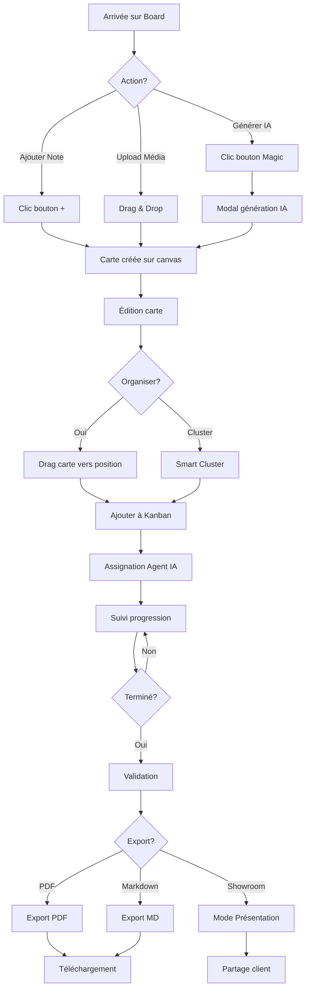
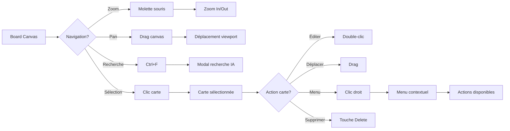
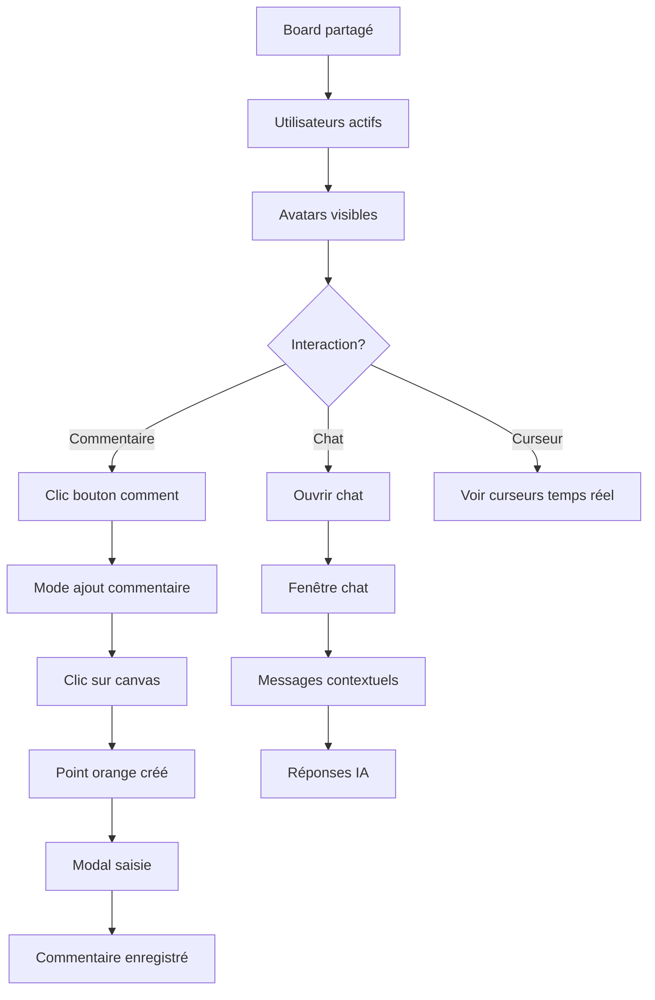
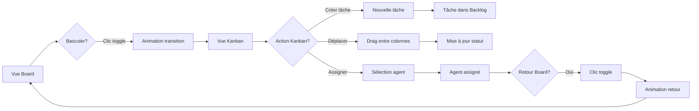

# 🧭 Système de Navigation - Elite Visuals

## 📋 Vue d'Ensemble

Ce document définit l'architecture complète du système de navigation pour Elite Visuals, incluant les flows utilisateur, les composants de navigation, l'ergonomie et l'accessibilité.

**Version:** 2.0.0  
**Date:** 20 Novembre 2024  
**Statut:** 🎯 Spécifications Complètes

---

## 🗺️ Architecture de Navigation

### Hiérarchie des Vues

```
Elite Visuals Application
│
├── 🏠 Vue Principale (/)
│   ├── Header Global
│   ├── Board Canvas (Zone principale)
│   ├── Kanban Sidebar (Rétractable)
│   └── Floating Tools
│
├── 🎭 Mode Showroom (/showroom/[id])
│   ├── Header Showroom
│   ├── Vue Présentation
│   ├── Navigation Slides
│   └── Watermarks
│
├── 🔍 Recherche IA (Modal)
│   ├── Barre de recherche
│   ├── Filtres avancés
│   └── Résultats
│
├── 💬 Chat Contextuel (Floating)
│   ├── Fenêtre chat
│   └── Historique
│
└── ⚙️ Paramètres (Modal)
    ├── Préférences utilisateur
    ├── Thème
    └── Raccourcis clavier
```

---

## 🎯 User Flows Détaillés

### Flow 1: Création de Contenu (Brief → Export)



### Flow 2: Navigation dans le Board



### Flow 3: Collaboration & Commentaires



### Flow 4: Transitions Board ↔ Kanban



---

## 🎨 Composants de Navigation

### 1. Header Global

**Fichier:** `components/layout/Header.tsx`

**Éléments:**
- Logo Elite Visuals (lien vers home)
- Titre du board (éditable)
- Avatars utilisateurs actifs
- Bouton "Inviter"
- Menu Export
- Bouton Paramètres

**Navigation:**
```typescript
// Clic logo → Retour accueil
// Clic avatar → Profil utilisateur
// Clic export → Menu déroulant (PDF, MD, Showroom)
```

### 2. Barre d'Outils Latérale (Floating)

**Fichier:** `components/navigation/FloatingToolbar.tsx` (À créer)

**Position:** Gauche du canvas

**Boutons:**
```typescript
[
  { icon: Plus, action: "addNote", tooltip: "Ajouter note (N)" },
  { icon: Wand2, action: "generateAI", tooltip: "Générer IA (G)" },
  { icon: Upload, action: "uploadFile", tooltip: "Upload (U)" },
  { icon: Search, action: "search", tooltip: "Rechercher (Ctrl+F)" },
  { icon: MessageCircle, action: "comment", tooltip: "Commentaire (C)" },
  { icon: Download, action: "export", tooltip: "Exporter (E)" },
  { icon: Eye, action: "showroom", tooltip: "Mode Showroom (S)" }
]
```

**Comportement:**
- Toujours visible
- Glow orange au survol
- Tooltips avec raccourcis
- Animation d'apparition

### 3. Menu Contextuel (Clic Droit)

**Fichier:** `components/navigation/ContextMenu.tsx` (À créer)

**Déclenchement:** Clic droit sur carte

**Options:**
```typescript
interface ContextMenuOption {
  label: string
  icon: LucideIcon
  action: () => void
  shortcut?: string
  divider?: boolean
}

const menuOptions = [
  { label: "Éditer", icon: Edit, action: editCard, shortcut: "E" },
  { label: "Dupliquer", icon: Copy, action: duplicate, shortcut: "Ctrl+D" },
  { label: "Ajouter au Kanban", icon: ListTodo, action: addToKanban },
  { divider: true },
  { label: "Changer couleur", icon: Palette, action: changeColor },
  { label: "Ajouter au cluster", icon: Layers, action: addToCluster },
  { divider: true },
  { label: "Générer enfants (IA)", icon: Sparkles, action: generateChildren },
  { divider: true },
  { label: "Supprimer", icon: Trash, action: deleteCard, shortcut: "Del" }
]
```

**Design:**
- Fond blanc
- Bordure orange subtile
- Ombre portée
- Animation fade-in
- Fermeture: clic extérieur ou Escape

### 4. Navigation Kanban

**Fichier:** `components/kanban/KanbanNavigation.tsx` (À créer)

**Éléments:**
- Toggle Board/Kanban
- Filtres par agent
- Filtres par statut
- Tri (date, priorité)
- Recherche dans tâches

**Toggle Board ↔ Kanban:**
```typescript
const [view, setView] = useState<'board' | 'kanban'>('board')

<Tabs value={view} onValueChange={setView}>
  <TabsList>
    <TabsTrigger value="board">
      <Layout className="h-4 w-4 mr-2" />
      Board
    </TabsTrigger>
    <TabsTrigger value="kanban">
      <ListTodo className="h-4 w-4 mr-2" />
      Kanban
    </TabsTrigger>
  </TabsList>
</Tabs>
```

### 5. Navigation Showroom

**Fichier:** `components/showroom/ShowroomNavigation.tsx` (À créer)

**Contrôles:**
- Flèches gauche/droite
- Indicateurs de position (dots)
- Barre de progression
- Bouton plein écran
- Bouton partage
- Bouton fermer

**Raccourcis clavier:**
```typescript
const keyboardShortcuts = {
  'ArrowRight': nextSlide,
  'ArrowLeft': previousSlide,
  'Escape': exitShowroom,
  'f': toggleFullscreen,
  'Space': toggleAutoplay
}
```

### 6. Breadcrumb Navigation

**Fichier:** `components/navigation/Breadcrumb.tsx` (À créer)

**Affichage:**
```
Home > Mes Boards > Campagne Orange 2024 > Board Principal
```

**Comportement:**
- Chaque niveau cliquable
- Dernier niveau en gras
- Séparateur: chevron orange
- Responsive: collapse sur mobile

---

## 🎮 Interactions Multi-Modales

### Navigation Souris

| Action | Comportement |
|--------|--------------|
| **Clic simple** | Sélectionner carte |
| **Double-clic** | Éditer carte |
| **Clic droit** | Menu contextuel |
| **Drag canvas** | Pan (déplacement) |
| **Drag carte** | Déplacer carte |
| **Molette** | Zoom in/out |
| **Ctrl + Molette** | Zoom rapide |
| **Shift + Drag** | Sélection multiple |

### Navigation Clavier

| Raccourci | Action |
|-----------|--------|
| **N** | Nouvelle note |
| **G** | Générer IA |
| **U** | Upload fichier |
| **Ctrl + F** | Rechercher |
| **Ctrl + Z** | Annuler |
| **Ctrl + Y** | Refaire |
| **Ctrl + D** | Dupliquer |
| **Delete** | Supprimer |
| **Ctrl + S** | Sauvegarder |
| **Ctrl + E** | Exporter |
| **Ctrl + K** | Toggle Kanban |
| **Escape** | Fermer modal/menu |
| **Tab** | Navigation focus |
| **Space** | Sélectionner |
| **Arrow Keys** | Déplacer sélection |
| **Ctrl + A** | Tout sélectionner |
| **Ctrl + /** | Aide raccourcis |

### Navigation Tactile (Mobile/Tablette)

| Geste | Action |
|-------|--------|
| **Tap** | Sélectionner |
| **Double-tap** | Éditer |
| **Long-press** | Menu contextuel |
| **Pinch** | Zoom |
| **Two-finger drag** | Pan |
| **Swipe left/right** | Navigation showroom |
| **Swipe up** | Ouvrir Kanban |
| **Swipe down** | Fermer Kanban |

---

## 📱 Navigation Responsive

### Breakpoints

```css
/* Mobile Small */
@media (max-width: 480px) {
  - Kanban en modal plein écran
  - Toolbar en bottom bar
  - Menu hamburger
  - Cartes empilées verticalement
}

/* Mobile */
@media (max-width: 768px) {
  - Kanban en drawer bottom
  - Toolbar réduite
  - Header compact
  - Touch-friendly (44px min)
}

/* Tablette */
@media (max-width: 1024px) {
  - Kanban sidebar rétractable
  - Toolbar complète
  - Header normal
}

/* Desktop */
@media (min-width: 1025px) {
  - Layout complet
  - Sidebar fixe
  - Tous les outils visibles
}
```

### Adaptations Mobile

**Bottom Navigation Bar:**
```typescript
<nav className="fixed bottom-0 left-0 right-0 bg-white border-t">
  <div className="flex justify-around p-2">
    <NavButton icon={Layout} label="Board" />
    <NavButton icon={Plus} label="Ajouter" />
    <NavButton icon={ListTodo} label="Kanban" />
    <NavButton icon={Search} label="Recherche" />
    <NavButton icon={Menu} label="Plus" />
  </div>
</nav>
```

**Drawer Menu:**
```typescript
<Sheet>
  <SheetTrigger>
    <Menu className="h-6 w-6" />
  </SheetTrigger>
  <SheetContent side="left">
    <SheetHeader>
      <SheetTitle>Navigation</SheetTitle>
    </SheetHeader>
    <nav className="flex flex-col gap-4 mt-6">
      {/* Menu items */}
    </nav>
  </SheetContent>
</Sheet>
```

---

## ♿ Accessibilité (WCAG 2.1 AA)

### Navigation Clavier

**Focus Visible:**
```css
*:focus-visible {
  outline: 2px solid #FF684A;
  outline-offset: 2px;
}
```

**Tab Order:**
```typescript
// Ordre logique de navigation
1. Header (logo, titre, actions)
2. Toolbar (boutons principaux)
3. Canvas (cartes)
4. Kanban sidebar
5. Footer
```

**Skip Links:**
```typescript
<a href="#main-content" className="sr-only focus:not-sr-only">
  Aller au contenu principal
</a>
<a href="#kanban" className="sr-only focus:not-sr-only">
  Aller au Kanban
</a>
```

### Screen Readers

**ARIA Labels:**
```typescript
<button
  aria-label="Ajouter une nouvelle note"
  aria-describedby="tooltip-add-note"
  aria-keyshortcuts="N"
>
  <Plus className="h-5 w-5" />
</button>

<div role="region" aria-label="Board Canvas">
  {/* Canvas content */}
</div>

<nav aria-label="Navigation principale">
  {/* Navigation items */}
</nav>
```

**Live Regions:**
```typescript
<div
  role="status"
  aria-live="polite"
  aria-atomic="true"
  className="sr-only"
>
  {statusMessage}
</div>

// Exemples de messages:
- "Carte ajoutée au board"
- "Zoom à 150%"
- "3 éléments sélectionnés"
- "Export PDF terminé"
```

### Contraste & Couleurs

**Ratios de contraste:**
- Texte normal: 4.5:1 minimum
- Texte large: 3:1 minimum
- Éléments UI: 3:1 minimum

**Palette accessible:**
```css
--primary: #FF684A;           /* Orange Elite */
--primary-dark: #E55535;      /* Contraste amélioré */
--text-primary: #1F2937;      /* Gris foncé 14:1 */
--text-secondary: #6B7280;    /* Gris moyen 7:1 */
--border: #E5E7EB;            /* Bordures subtiles */
```

**Mode sombre (optionnel):**
```css
@media (prefers-color-scheme: dark) {
  --background: #111827;
  --text-primary: #F9FAFB;
  --primary: #FF8A6E;  /* Orange plus clair */
}
```

### Taille des Cibles

**Minimum 44x44px pour tactile:**
```css
.touch-target {
  min-width: 44px;
  min-height: 44px;
  padding: 12px;
}
```

---

## 🎨 Design System Navigation

### Composants UI

**Bouton Navigation:**
```typescript
interface NavButtonProps {
  icon: LucideIcon
  label: string
  active?: boolean
  badge?: number
  onClick: () => void
  shortcut?: string
}

<NavButton
  icon={Layout}
  label="Board"
  active={view === 'board'}
  onClick={() => setView('board')}
  shortcut="Ctrl+B"
/>
```

**Indicateur de Position:**
```typescript
<div className="flex gap-2">
  {items.map((_, index) => (
    <button
      key={index}
      className={cn(
        "w-2 h-2 rounded-full transition-all",
        index === current
          ? "bg-primary w-8"
          : "bg-gray-300 hover:bg-gray-400"
      )}
      onClick={() => goToSlide(index)}
      aria-label={`Aller à la slide ${index + 1}`}
    />
  ))}
</div>
```

**Breadcrumb:**
```typescript
<nav aria-label="Fil d'Ariane">
  <ol className="flex items-center gap-2">
    {path.map((item, index) => (
      <li key={index} className="flex items-center gap-2">
        {index > 0 && <ChevronRight className="h-4 w-4 text-gray-400" />}
        <a
          href={item.href}
          className={cn(
            "text-sm hover:text-primary transition-colors",
            index === path.length - 1
              ? "font-semibold text-gray-900"
              : "text-gray-600"
          )}
        >
          {item.label}
        </a>
      </li>
    ))}
  </ol>
</nav>
```

### Animations de Transition

**Page Transitions:**
```typescript
const pageVariants = {
  initial: { opacity: 0, x: -20 },
  animate: { opacity: 1, x: 0 },
  exit: { opacity: 0, x: 20 }
}

<motion.div
  variants={pageVariants}
  initial="initial"
  animate="animate"
  exit="exit"
  transition={{ duration: 0.3 }}
>
  {children}
</motion.div>
```

**Sidebar Slide:**
```typescript
const sidebarVariants = {
  open: { x: 0, opacity: 1 },
  closed: { x: 384, opacity: 0 }
}

<motion.aside
  variants={sidebarVariants}
  animate={isOpen ? "open" : "closed"}
  transition={{ type: "spring", stiffness: 300, damping: 30 }}
>
  {/* Kanban content */}
</motion.aside>
```

**Menu Fade:**
```typescript
<AnimatePresence>
  {isOpen && (
    <motion.div
      initial={{ opacity: 0, scale: 0.95 }}
      animate={{ opacity: 1, scale: 1 }}
      exit={{ opacity: 0, scale: 0.95 }}
      transition={{ duration: 0.15 }}
    >
      {/* Menu content */}
    </motion.div>
  )}
</AnimatePresence>
```

---

## 🔄 États de Navigation

### Loading States

```typescript
// Navigation en cours
<div className="flex items-center gap-2">
  <Loader2 className="h-4 w-4 animate-spin text-primary" />
  <span>Chargement du board...</span>
</div>

// Skeleton
<div className="space-y-4">
  <Skeleton className="h-12 w-full" />
  <Skeleton className="h-64 w-full" />
</div>
```

### Error States

```typescript
// Erreur de navigation
<Alert variant="destructive">
  <AlertCircle className="h-4 w-4" />
  <AlertTitle>Erreur de chargement</AlertTitle>
  <AlertDescription>
    Impossible de charger le board. 
    <Button variant="link" onClick={retry}>
      Réessayer
    </Button>
  </AlertDescription>
</Alert>
```

### Empty States

```typescript
// Board vide
<div className="flex flex-col items-center justify-center h-full text-center p-8">
  <Layout className="h-16 w-16 text-gray-300 mb-4" />
  <h3 className="text-lg font-semibold text-gray-900 mb-2">
    Board vide
  </h3>
  <p className="text-sm text-gray-600 mb-4">
    Commencez par ajouter une note ou uploader un fichier
  </p>
  <div className="flex gap-2">
    <Button onClick={addNote}>
      <Plus className="h-4 w-4 mr-2" />
      Ajouter une note
    </Button>
    <Button variant="outline" onClick={uploadFile}>
      <Upload className="h-4 w-4 mr-2" />
      Upload
    </Button>
  </div>
</div>
```

---

## 📊 Métriques de Navigation

### KPIs à Suivre

```typescript
interface NavigationMetrics {
  // Temps moyen par vue
  avgTimeOnBoard: number
  avgTimeOnKanban: number
  avgTimeOnShowroom: number
  
  // Actions de navigation
  boardToKanbanSwitches: number
  searchUsage: number
  contextMenuUsage: number
  keyboardShortcutUsage: number
  
  // Performance
  navigationSpeed: number  // ms
  transitionDuration: number  // ms
  
  // Accessibilité
  keyboardOnlyUsers: number
  screenReaderUsers: number
}
```

### Analytics

```typescript
// Tracker les actions de navigation
trackEvent('navigation', {
  from: 'board',
  to: 'kanban',
  method: 'button_click',
  duration: 250
})

trackEvent('shortcut_used', {
  key: 'Ctrl+F',
  action: 'search',
  context: 'board'
})
```

---

## 🚀 Implémentation

### Priorités

**Phase 1 - Essentiel (Semaine 1-2):**
- ✅ Floating Toolbar
- ✅ Context Menu
- ✅ Keyboard Shortcuts
- ✅ Board/Kanban Toggle

**Phase 2 - Amélioration (Semaine 3-4):**
- ✅ Breadcrumb Navigation
- ✅ Showroom Navigation
- ✅ Mobile Bottom Bar
- ✅ Accessibility Features

**Phase 3 - Optimisation (Semaine 5-6):**
- ✅ Animations avancées
- ✅ Gesture Support
- ✅ Performance Optimization
- ✅ Analytics Integration

### Checklist de Validation

- [ ] Tous les raccourcis clavier fonctionnent
- [ ] Navigation au clavier complète (Tab)
- [ ] Screen readers compatibles
- [ ] Contraste WCAG AA respecté
- [ ] Touch targets 44x44px minimum
- [ ] Animations fluides (60 FPS)
- [ ] Responsive sur tous devices
- [ ] Loading/Error states gérés
- [ ] Analytics implémentés
- [ ] Documentation utilisateur créée

---

## 📚 Ressources

### Documentation
- [WCAG 2.1 Guidelines](https://www.w3.org/WAI/WCAG21/quickref/)
- [WAI-ARIA Practices](https://www.w3.org/WAI/ARIA/apg/)
- [Framer Motion Docs](https://www.framer.com/motion/)
- [Radix UI Navigation](https://www.radix-ui.com/primitives)

### Outils
- **axe DevTools**: Test d'accessibilité
- **Lighthouse**: Audit performance
- **React DevTools**: Debug composants
- **Keyboard Viewer**: Test navigation clavier

---

**Créé avec ❤️ pour Elite Visuals**  
**Version:** 2.0.0  
**Dernière mise à jour:** 20 Novembre 2024
